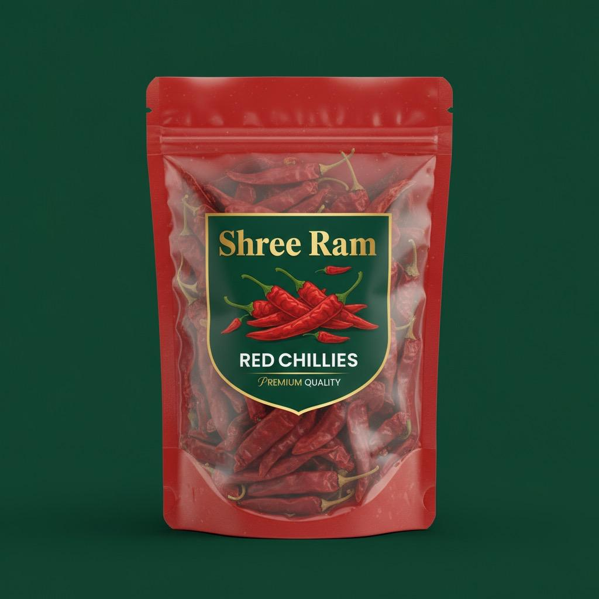

# my-app-delivery-service
all fresh items at your door step
<!DOCTYPE html>
<html lang="en">
<head>
    <meta charset="UTF-8">
    <title>Freshfoods Dashboard</title>
    
</head>
<body>

    

        <button onclick="showSection('home')">Home</button>
        <button onclick="showSection('groceries')">Groceries</button>
        <button onclick="showSection('camera')">Camera</button>
        <button onclick="showSection('orders')">Orders</button>
        <button onclick="showSection('contact')">Contact</button>
        <button style="margin-top:auto;" onclick="showSection('profile')">Profile</button>
    

    

        <!-- Home Section -->
        

            <h2>Welcome to Freshfoods!</h2>
            
All items view and info.

        

        <!-- Groceries Section -->
        

            <h2>Groceries</h2>
            <ul>
                <li>Rice</li>
                <li>Pulses</li>
                <li>Wheat Flour</li>
                <li>Spices</li>
                <!-- Add more -->
            </ul>
        

        <!-- Camera Section -->
        

            <h2>Open Camera</h2>
            <video id="video" width="320" height="240" autoplay></video>
            <button onclick="capturePhoto()">Capture</button>
            <canvas id="canvas" width="320" height="240" style="display:none;"></canvas>
            
            
        

        <!-- Orders Section -->
        

            <h2>Your Orders</h2>
            
No orders yet.

        

        <!-- Contact Section -->
        

            <h2>Contact Us</h2>
            
Call us: 8917143043

            
Email: support@freshfoods.com

        

        <!-- Profile Section -->
        

            <h2>Profile</h2>
            <form id="order-form">
                <label>Name:</label>
                <input type="text" id="name" required>
                <label>Mobile Number:</label>
                <input type="text" id="mobile" required>
                <label>Order:</label>
                <input type="text" id="order">
                <label>Delivery Address:</label>
                <textarea id="address"></textarea>
                <button type="button" onclick="submitOrder()">Submit Order</button>
            </form>
        

    

</body>
</html>
